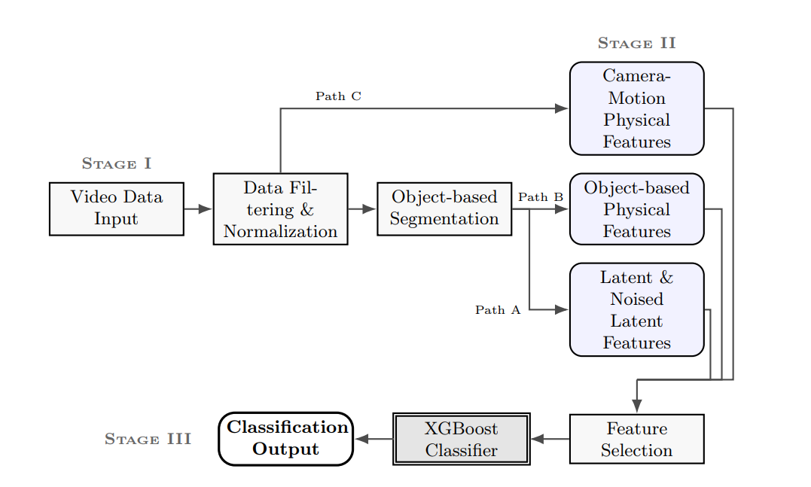

# PhysVid-Det: Physics and Latent Feature-Based Detection of AI-Generated Videos.

End-to-end pipeline for AI-video detection that fuses diffusion-latent statistics, object-based physics and camera-motion physics in one XGBoost classifier -- 74 final features, seen **AUC/Acc 0.995/0.972**, LOGO **AUC/Acc 0.981/0.925**.


📄 **Full diploma write-up:** [Google Drive (PDF)](https://drive.google.com/file/d/1bYV7-nopmL8dd-t1gc4S-cxf6j3WCUsP/view?usp=sharing)

## Pipeline overview



Three stages:
- **Stage I** — Data filtering, normalization, object-based segmentation (Video-LLaVA + SAM 3).
- **Stage II** — Three parallel feature paths over the segmented video:
  - **Path A:** Latent + Noised-latent features (Stable Diffusion VAE + DDIM inversion).
  - **Path B:** Object-based physical features computed from object masks.
  - **Path C:** Camera-motion physical features from VGGT poses & depth.
- **Stage III** — Feature selection + XGBoost classifier → real / fake.


## Repository layout

| Folder | What it does |
|---|---|
| [`segmentation/`](segmentation/) | Detect main objects (Video-LLaVA) and track them across frames (SAM 3). |
| [`latent_features/`](latent_features/) | Encode frames with Stable Diffusion VAE, run DDIM inversion, derive latent + noise features. |
| [`physics_features/`](physics_features/) | Compute inter-object motion / shape / edge consistency features from saved masks. |
| [`camera_motion_features/`](camera_motion_features/) | Use VGGT to estimate camera poses + depth and derive motion features. |
| [`training_testing/`](training_testing/) | Train, tune, compare and save the final XGBoost model. (+ comparison with existing methods based on their choises of protocols.) |
| [`inference_pipeline/`](inference_pipeline/) | Single-video end-to-end predictor. Run `predict_video.py video.mp4`. |
| [`saved_models/`](saved_models/) | Final XGBoost weights, scaler, and the 74 feature names the model expects. |
| [`video_preprocess/`](video_preprocess/) | Colab notebooks for downloading + filtering source datasets. |

---

# 1️⃣  Part 1 — Using the pretrained model

If you only want to **classify your own videos** as real / fake, you don't have to download the dataset or extract any features — the trained classifier in [`saved_models/`](saved_models/) is enough.

## Quick start — predict on one video

```bash
# 1. install
python -m venv .venv && source .venv/bin/activate     # Linux/Mac
pip install -r requirements.txt
git clone https://github.com/facebookresearch/vggt.git && cd vggt && pip install -e . && cd ..

# 2. login to HF and request access to gated models
#    SAM 3 (facebook/sam3) requires accepting the model card at https://huggingface.co/facebook/sam3
#    Video-LLaVA (LanguageBind/Video-LLaVA-7B-hf) is open but you still need a token to download
huggingface-cli login

# 3. run
python inference_pipeline/predict_video.py path/to/video.mp4
```

Output:
```
============================================================
  prediction  : FAKE
  confidence  : 0.984
  P(real)     : 0.0157
  P(fake)     : 0.9843
  features    : 74
  (model trained at AUC=0.995, Acc=0.971)
============================================================
```

See [`inference_pipeline/README.md`](inference_pipeline/README.md) for full options and troubleshooting.

## Models pulled from Hugging Face on first run

| Model | Used for | Size |
|---|---|---|
| `LanguageBind/Video-LLaVA-7B-hf` | object naming | ~15 GB |
| `facebook/sam3` | mask tracking | ~0.5 GB |
| `runwayml/stable-diffusion-v1-5` | latent encoding + DDIM inversion | ~5 GB |
| `facebook/VGGT-1B` | camera poses + depth | ~4 GB |

Total disk footprint after first run: ~25 GB in `~/.cache/huggingface/`.

## Hardware (inference)

- **Recommended:** single GPU with ≥ 24 GB VRAM (RTX 3090/4090, A5000, A100). The pipeline loads the four foundation models sequentially and frees VRAM between stages — see [`inference_pipeline/predict_video.py`](inference_pipeline/predict_video.py).
- **Disk:** at least 60 GB free for HF cache + working frames.
- **Tested on:** Vast.ai RTX 4090 (24 GB).

## Limitations

- The training set consists of **horizontal** web/studio clips. Modern phone-shot **vertical** videos sit outside this distribution and are often misclassified as fake — a domain-shift effect.
- The fake-video source covers **only diffusion-based generators**; non-diffusion synthesis families (e.g. autoregressive, GAN-based, etc) are not represented in training and may degrade detection.
- For higher real-world accuracy, the model would benefit from broader **diversity in the real-video pool** (more domains, devices, aspect ratios) and a **wider variety of fake sources** (newer models and non-diffusion architectures).

---

# 2️⃣  Part 2 — Reproducing / extending results

This part is for researchers who want to **retrain the classifier**, **add new features**, or **benchmark on the original dataset**. None of this is needed just to use the pretrained model.

## Datasets

The full **PhysVid-Det** dataset used in this work is published on Hugging Face:

🤗 **[ironiss/PhysVid-Det-DATA](https://huggingface.co/datasets/ironiss/PhysVid-Det-DATA)** *(private — request access)*

Hosted privately to comply with the redistribution terms of the upstream sources. The pre-extracted features in [`feature_data/`](feature_data/) are public and fully reproduce all classifier results — see [Pre-computed features](#pre-computed-features-skip-extraction).

If you do get access, the videos are raw (NOT pre-segmented — run [`segmentation/segment_dataset.py`](segmentation/segment_dataset.py) first).

Composition:

- **Real (~16k clips):** GenVideo-Real, Kinetics-400 (selected clips), UCF-101.
- **Fake (~18k clips):** GenVideo benchmark — DynamicCrafter, Latte, OpenSora, Pika, SEINE, SVD, VideoCrafter, ZeroScope.

```bash
# pull the raw dataset
huggingface-cli download ironiss/PhysVid-Det-DATA --repo-type dataset --local-dir videos/

# then run segmentation before feature extraction
python segmentation/segment_dataset.py --data-dir videos/ --out-dir segmented_data/
```

## Pre-computed features (skip extraction)

If you only want to retrain or analyse the classifier without spending days on feature extraction, the **already-extracted features** are committed under [`feature_data/`](feature_data/) — these are the exact CSVs that [`training_testing/save_model/save_final_model.py`](training_testing/save_model/save_final_model.py) reads:

| File | Content | Size |
|---|---|---|
| [`feature_data/latent_noise_festures.csv`](feature_data/) | 80 latent + noise features per video | ~52 MB |
| [`feature_data/object_based_features.csv`](feature_data/) | 26 object-based physics features per video | ~16 MB |
| [`feature_data/camera_motion_features.csv`](feature_data/) | 18 camera-motion features per video | ~14 MB |

Each CSV has columns `path` (or `video`), `label`, then one column per feature. **Raw total: 124 features.** After `basic_cleanup` (NaN-heavy + correlated drop) and `safe_filter` (generator-leaky drop), **74 features** remain — these are the ones the production model uses; their canonical ordering is in [`saved_models/feature_names.json`](saved_models/feature_names.json). The three files are aligned by video filename inside `save_final_model.py`.

With these in place you can **skip every extraction step** and go straight to training:

```bash
python training_testing/save_model/save_final_model.py
```

## Reproducing from scratch (full pipeline)

> ⚠️ **Heavy: full retraining is a multi-day, multi-GPU job.** 

```bash
# segment objects in every video (Video-LLaVA + SAM 3) -> segmented_data/<hash>/{frames,masks,meta.json}
python segmentation/segment_dataset.py --data-dir videos/ --out-dir segmented_data/ --num-gpus 8

# latent + noise features per video (Stable Diffusion VAE + DDIM inversion). Caches z0/eps so re-extraction is ~200× faster.
python latent_features/extract_latent_features.py --data-dir segmented_data/ --out feature_data/latent_noise_festures.h5 --cache-dir latent_cache --shard 0 --n-shards 8

# object-based physics features per video (uses the masks above)
python physics_features/extract_features.py --data-dir segmented_data/ --out feature_data/object_based_features.h5 --workers 16

# camera-motion features per video (VGGT poses + depth)
python camera_motion_features/run_dataset_fast.py

# train XGBoost on the merged features and save artifacts to saved_models/
python training_testing/save_model/save_final_model.py
```

---

## License

Apache 2.0 — see [LICENSE](LICENSE).
