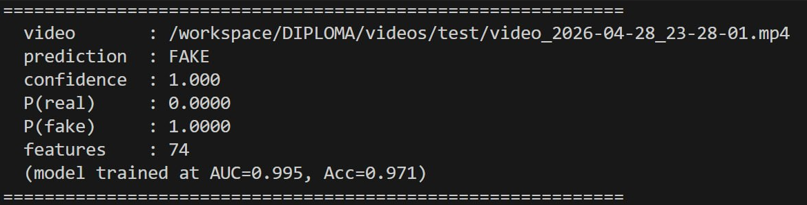

# Inference pipeline

End-to-end predictor for a single video: segmentation -> latent + physics + camera features -> XGBoost classifier (`saved_models/`).

| File | What |
|---|---|
| `predict_video.py` | the only entry. 4 stages, sequential model loading + GPU unload between stages |

Stages (run in order, VRAM freed after each):
1. Video-LLaVA + SAM 3 segmentation -> frames + masks
2. SD VAE + DDIM inversion -> latent / noise features
3. physics features from masks
4. VGGT -> camera-motion features

The 124 raw features are aligned to the 74 names in `saved_models/feature_names.json`, scaled, and fed to `final_model.json`.

## Run

```
python predict_video.py path/to/video.mp4
```

Useful flags:

- `--work-dir DIR` -- keep intermediate frames/masks instead of a temp dir
- `--keep-temp` -- keep the temp dir after run
- `--skip-segmentation --segmented-dir <DIR>` -- reuse an existing `segmented_data/<hash>/` (faster on re-runs)
- `--out-json result.json` -- dump full result (incl. all 124 raw features)

## Example

Sample fake video shipped in [`example_videos/generated_video_sample.mp4`](example_videos/generated_video_sample.mp4):


> 🐱 That's my cat! The clip was generated from a single still photo of him by an unknown image-to-video model -- a nice in-the-wild test for the detector.

```
python inference_pipeline/predict_video.py inference_pipeline/example_videos/generated_video_sample.mp4
```

Result:



## Requirements

Models pulled from HF on first run (~25 GB cached): `LanguageBind/Video-LLaVA-7B-hf`, `facebook/sam3` (gated), `runwayml/stable-diffusion-v1-5`, `facebook/VGGT-1B`.

```
huggingface-cli login   # accept facebook/sam3 model card first
```

Recommended GPU: >=24 GB VRAM. Models are loaded sequentially, so peak VRAM ~= largest single stage, not their sum.

## Limitations

Reminder: feed **horizontal** videos -- vertical clips are out-of-distribution and often misclassified. See the root [README](../README.md#limitations) for the full list.
